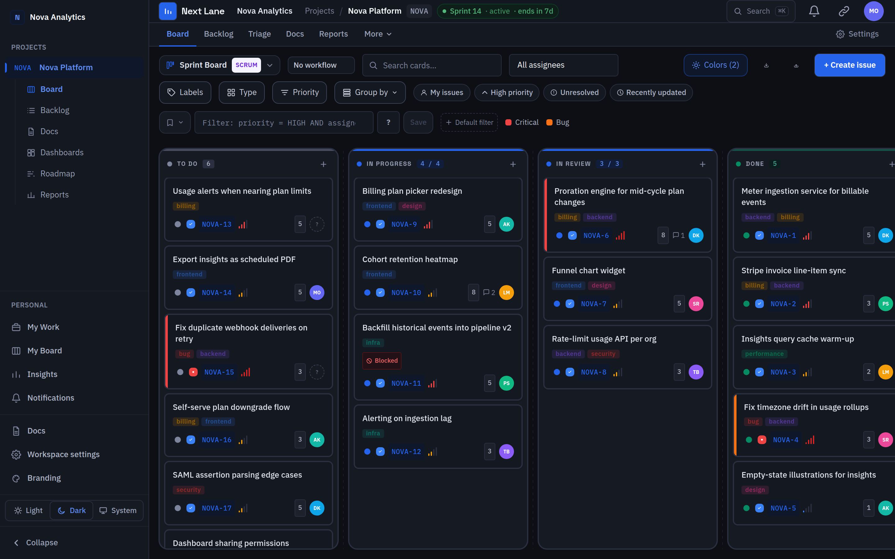
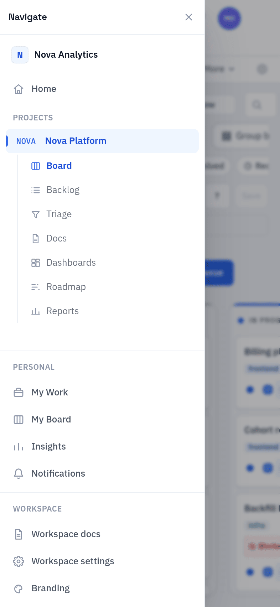
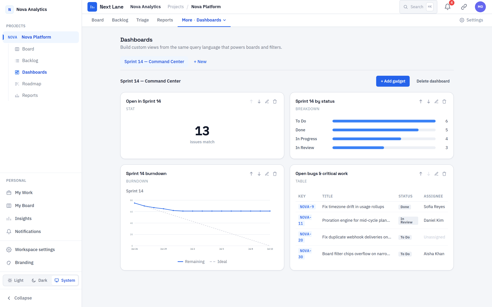
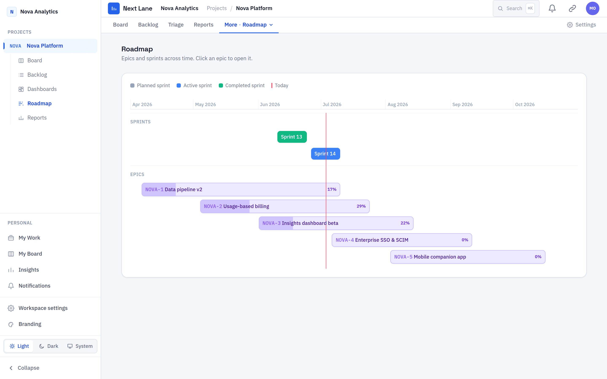
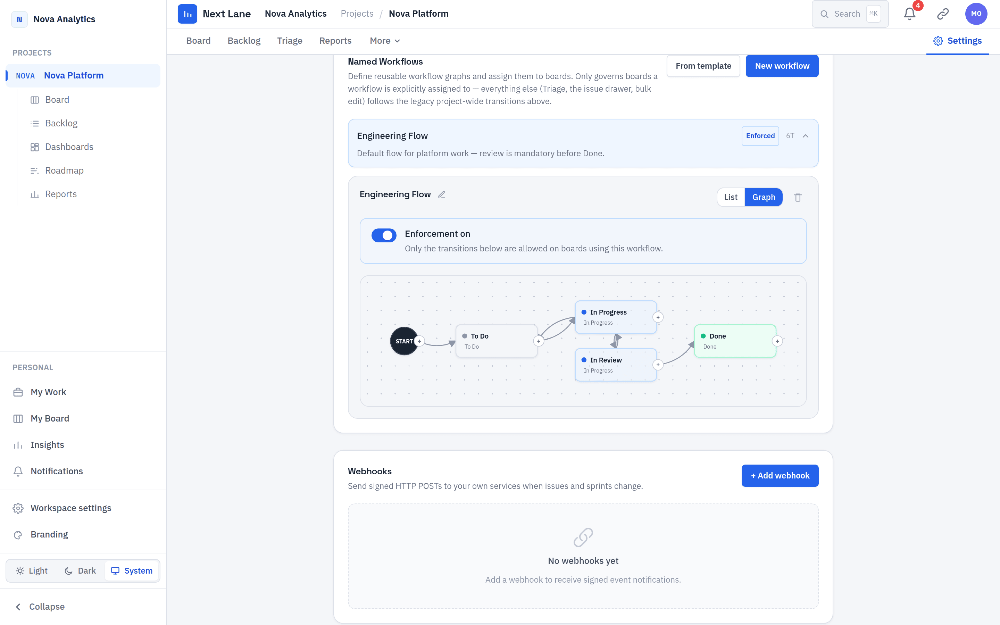
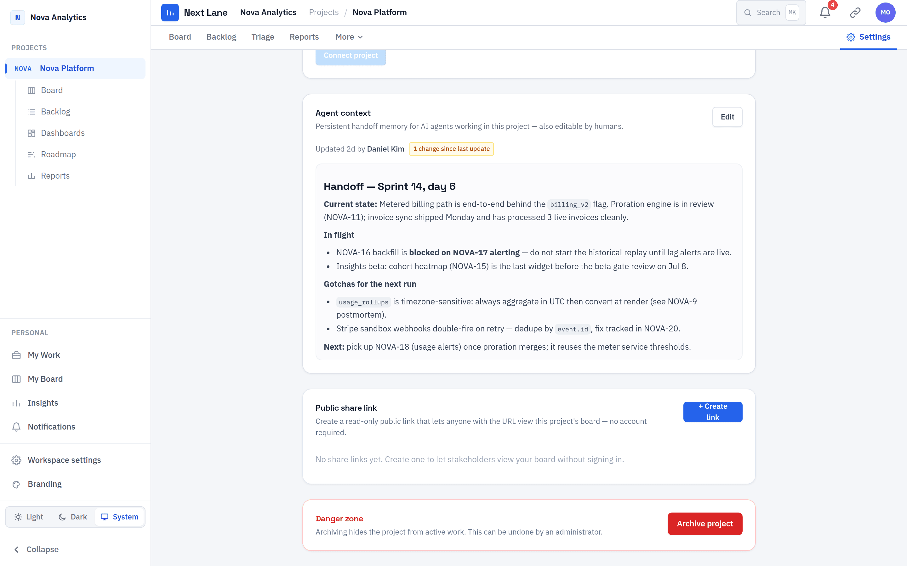
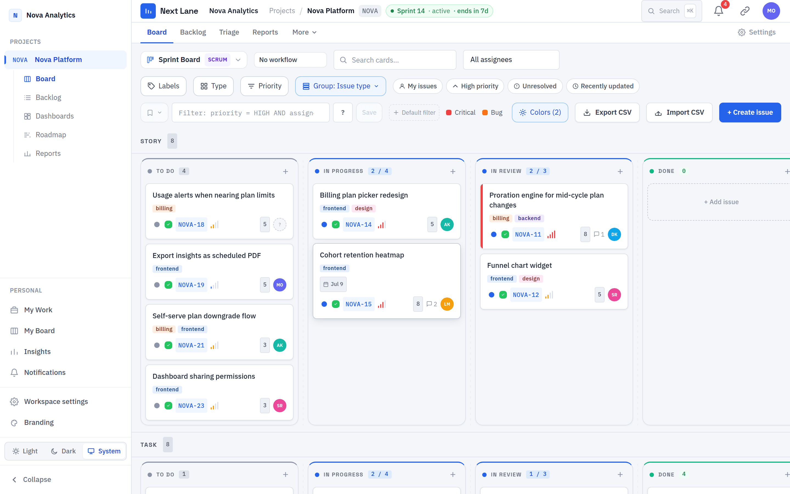
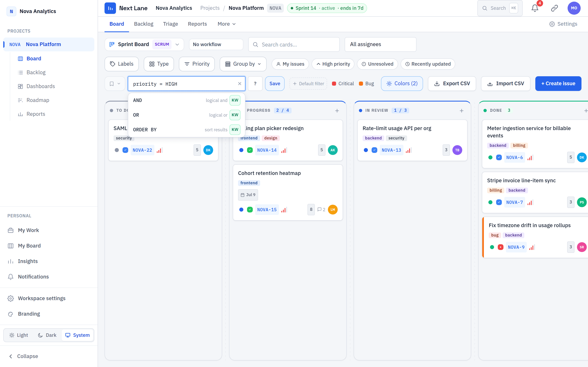
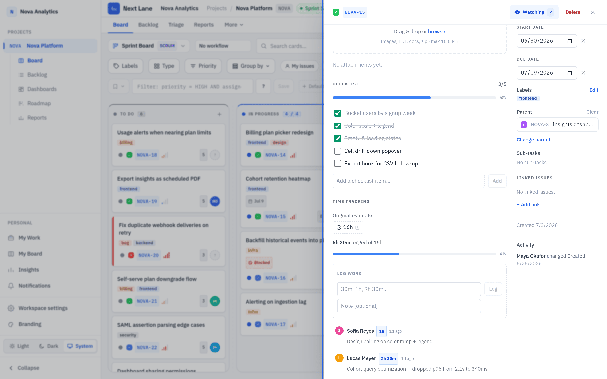
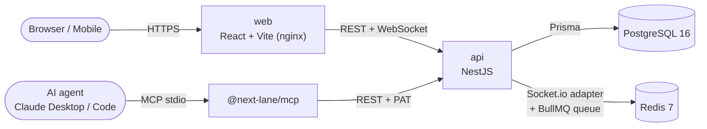

<div align="center">

# Next Lane

### The open-source, self-hosted issue &amp; project tracker — AI-native and agent-native, free and unlimited where the leading per-seat incumbent charges per head.

Next Lane is an **open source project tracker**: boards, sprints, backlog, custom
workflows, and reporting, running entirely on **your** hardware with **your** data,
under an MIT license. It's also built for a world where AI coding agents write half
your code — a first-party **MCP server** with 97 tools lets Claude (or any MCP
client) **read and write your tracker directly**, not just chat about it.

**⭐ If Next Lane is useful to you (or your agent), starring the repo helps other
teams find it — that's the only ask.**

[](./LICENSE)
[](https://overcastly-ai.github.io/Next-Lane/)
[](https://github.com/Overcastly-AI/Next-Lane/actions/workflows/ci.yml)
[](https://github.com/Overcastly-AI/Next-Lane/actions/workflows/e2e.yml)
[](./apps/mcp/README.md)
[](./docs/ROADMAP.md)
[](https://www.typescriptlang.org/)
[](#-quickstart)
[](#why-next-lane)
[](./CONTRIBUTING.md)

Built by [Overcastly AI](https://overcastly.com?utm_source=github&utm_medium=readme&utm_campaign=next-lane&utm_content=hero)

[Quick Start](#-quickstart) · [📖 Documentation](https://overcastly-ai.github.io/Next-Lane/) · [Why Next Lane](#why-next-lane) · [How it compares](#-how-next-lane-compares) · [MCP / agents](#-agent-native-your-coding-agent-can-run-the-tracker) · [Features](#-whats-shipped) · [Architecture](#-architecture-at-a-glance) · [Roadmap](#-on-the-roadmap) · [Contributing](#-contributing) · [Changelog](./CHANGELOG.md)

</div>

---

### 60-second start

```bash
git clone https://github.com/Overcastly-AI/Next-Lane.git && cd Next-Lane
cp .env.example .env && echo "JWT_SECRET=$(openssl rand -hex 32)" >> .env
docker compose up -d --build
```

Open **http://localhost:3000** and log in with `demo@nextlane.dev` / `nextlane`
— a full demo workspace is seeded automatically. Full prerequisites, ports, and
a hot-reload dev setup are in [Quickstart](#-quickstart) below.

---

## Table of Contents

- [Why Next Lane](#why-next-lane)
- [Screenshots](#-screenshots)
- [How Next Lane compares](#-how-next-lane-compares)
- [Agent-native: your coding agent can run the tracker](#-agent-native-your-coding-agent-can-run-the-tracker)
- [Built by AI, dogfooding itself](#-built-by-ai-dogfooding-itself)
- [What's shipped](#-whats-shipped)
- [Quick Start](#-quickstart)
- [Local development](#-local-development-hot-reload-no-docker-for-app-code)
- [Architecture at a glance](#-architecture-at-a-glance)
- [On the roadmap](#-on-the-roadmap)
- [Contributing](#-contributing)
- [License](#-license)

---

## Screenshots

<div align="center">
  
</div>

<br/>

<div align="center">
  
  
</div>

<br/>

<div align="center">
  
  
  
</div>

<br/>

<div align="center">
  
  
</div>

<details>
<summary><strong>More screenshots</strong> — dashboards, roadmap/Gantt, the visual workflow builder, NLQL autocomplete, agent context, and more</summary>

<br/>

<div align="center">
  
  
</div>

<br/>

<div align="center">
  
  
</div>

<br/>

<div align="center">
  
  
</div>

<br/>

<div align="center">
  
  
</div>

</details>

## Why Next Lane

Most issue trackers and project management tools are cloud SaaS billed **per user,
per month** — your roadmap lives on someone else's server and the price grows with
your team. Next Lane flips that: a **self-hosted project tracker** that runs
entirely on your own machine via Docker, where the marginal cost of a seat on
*your* hardware is zero — so it's free and unlimited by design.

But free isn't the bar. The question every release is held to is: **is this better
than the tracker you're paying for — as a daily driver?** Not cheaper: faster on the
board, sharper in search, a workflow that bends to your process, and legible to the
coding agents that now write half your code. Where the honest answer is "not yet,"
that gap is the next thing we build (see the scorecard in
[`docs/VISION.md`](./docs/VISION.md)).

We don't try to out-checklist a 20-year-old incumbent. We win on four **structural
advantages** a cloud-first, per-seat, closed product can't match (full thesis in
[`docs/VISION.md`](./docs/VISION.md)):

|  | Advantage | What it means for you |
|---|---|---|
| 💸 | **Free & unlimited** | No per-seat pricing. Unlimited users, projects, automation runs, and (on the roadmap) AI — because it's your hardware. |
| 🔒 | **Your data, your compute** | Fully self-hosted. No egress, direct SQL access to your own data, private by default — the one thing regulated teams can't buy from any cloud. |
| 🧩 | **Open & extensible** | MIT licensed. No marketplace tax, code-level extensibility, and two-way links to self-hosted-friendly forges (GitHub and GitLab today), not just the big clouds. |
| 🤖 | **AI-native & agent-native** | An MCP server ships in the box with persistent per-project agent memory, and the product itself is built and dogfooded by a team of AI agents — see below. |

## 📊 How Next Lane compares

Honest, feature-for-feature framing against the closed, per-seat trackers this
category is dominated by (see the full [honest scorecard](./docs/VISION.md#better-than-jira-scorecard)
for where we're still catching up):

| | Next Lane | Typical closed, per-seat tracker |
|---|---|---|
| **Pricing** | Free & unlimited — unlimited users, projects, automation runs | Priced per seat; automation/reporting/AI often gated to higher tiers |
| **Hosting & data** | Self-hosted via Docker Compose or Kubernetes — your Postgres, your box, no egress | Vendor's cloud only — your data lives on their servers |
| **License** | MIT — read the source, fork it, extend it | Closed source |
| **Query language** | **NLQL** — one query language for search, saved filters, automations, *and* dashboards | Separate, non-interchangeable mechanisms for search vs. automation vs. dashboards |
| **AI / agent access** | **MCP-native**: 97-tool server (read *and* write), server-side NLQL filtering, and **persistent per-project agent memory** that survives across sessions | Bolt-on AI add-ons, usually cloud-only, rate- or seat-limited — no first-party protocol for an agent to read *and* write |
| **Source-control links** | Two-way GitHub **and** GitLab issue ↔ PR/commit/branch linking, HMAC-verified webhooks | Varies by vendor and pricing tier |
| **Setup** | `docker compose up -d --build` on hardware you already own | Nothing to run — but nothing you can run yourself, either |

**Honest limits, not glossed over:** mobile is web-only today (no native app —
see the [scorecard](./docs/VISION.md#better-than-jira-scorecard) for current
rough edges being tracked); SSO ships as OIDC today, with SAML and
multi-provider on the [roadmap](#-on-the-roadmap); GitHub and GitLab are
shipped, Gitea is next. We'd rather tell you where we're behind than let you
find out after `docker compose up`.

## 🤖 Agent-native: your coding agent can run the tracker

This is the part no incumbent — closed or open — has: an issue tracker built for
a world where AI agents are first-class users, not an API afterthought.

Next Lane ships **`@next-lane/mcp`** — a first-party [Model Context
Protocol](https://modelcontextprotocol.io) server with **97 tools** (41 read, 56
write) that let Claude Desktop, Claude Code, or any MCP client **read *and write*
your workspace**: issues (with server-side **NLQL** `query` evaluation and
pagination), sprints, comments, worklogs, checklists, labels, components,
versions, NLQL-native dashboards, saved filters, automations, GitHub/GitLab links,
personal boards, issue templates, analytics, reports, bulk updates, CSV export,
role overrides, and one-call rollups like `get_epic_overview` — plus the
workflow/SDLC graph itself (statuses, transitions, gates, board assignment). No
other open tracker exposes its own SDLC as an agent-editable surface.

**Agents get persistent memory, too.** Every project keeps a shared **agent-context
document** — a handoff each run reads first and writes last — with a measured
staleness signal (`changesSinceUpdate`: real project activity since the last
handoff, so an agent knows when to re-verify instead of trusting blindly). A
distributable [`project-context` Agent Skill](./skills/project-context/SKILL.md)
bakes the read-first / hand-off-last discipline into any skills-capable agent:

```bash
cp -r skills/project-context ~/.claude/skills/
```

Token-efficient throughout: a compact result envelope (50 items/page by default),
`verbose: true` opt-in for full DTOs — a real field measurement put the same
`list_issues` call at 11 KB compact vs. 84–150 KB verbose.

> "The handoff-document feature was the exact right thing to build… If those land
> next, it's genuinely production-grade for AI-agent-driven project management."
>
> — unsolicited field review from an AI coding agent using Next Lane's MCP server

Full tool reference: [`apps/mcp/README.md`](./apps/mcp/README.md). Connect it to
Claude Code in one command once you have a personal access token (log in →
`Profile Settings → API Tokens`):

```bash
pnpm --filter @next-lane/mcp build

claude mcp add next-lane \
  -e NEXT_LANE_API_URL=http://localhost:4000 \
  -e NEXT_LANE_TOKEN=nlp_your_token_here \
  -- node /absolute/path/to/Next-Lane/apps/mcp/dist/index.js
```

Or drop this into `claude_desktop_config.json`:

```json
{
  "mcpServers": {
    "next-lane": {
      "command": "node",
      "args": ["/absolute/path/to/Next-Lane/apps/mcp/dist/index.js"],
      "env": {
        "NEXT_LANE_API_URL": "http://localhost:4000",
        "NEXT_LANE_TOKEN": "nlp_your_token_here"
      }
    }
  }
}
```

Now your agent can triage the backlog with a single NLQL query, summarize an epic
with one call, move an issue across a gated workflow, file a bug from a stack
trace, or pick up exactly where the last session left off — all from the terminal
it's already in.

## 🤖 Built by AI, dogfooding itself

This isn't a marketing line — check the log. Every one of Next Lane's 300+ commits
is authored by an autonomous Claude Code agent team (`.claude/agents/`: schema,
backend, frontend, code-review, QA, and audit specialists) working off the tracker's
own `docs/ROADMAP.md` and `docs/BACKLOG.md` — the same artifacts the MCP server
exposes to any agent. The team that builds Next Lane runs Next Lane.

## ✨ What's shipped

A credible daily-driver **project management tool** today — not a toy. Everything
below is **live in the current build** (see [`docs/ROADMAP.md`](./docs/ROADMAP.md)
for status and what's next), grouped by who it's for:

**For teams** — multiple Kanban/Scrum boards with drag-and-drop, sprints and
backlog, custom workflows with transition gates, the **NLQL** query language
(search, saved filters, *and* dashboards), full-text search + ⌘K palette,
realtime collaboration, configurable dashboards (STAT/TABLE/BREAKDOWN/BURNDOWN),
burndown/velocity/CFD reports, planning poker, and async standups.

**For self-hosters** — one-command Docker Compose or Helm/Kustomize for
Kubernetes, SSO/OIDC with in-app admin configuration, per-project role overrides,
GitHub and GitLab two-way integration with HMAC-verified webhooks, workspace
branding, and a 102-endpoint tenant-isolation regression matrix.

**For AI-agent users** — the 97-tool `@next-lane/mcp` server, server-side NLQL
filtering, one-call epic rollups, persistent per-project agent memory, an
installable Agent Skill, and personal API tokens scoped for agent auth.

The full capability matrix:

| Area | Capabilities |
|------|-------------|
| **Boards** | Multiple boards per project · Kanban **and** Scrum board types · drag-and-drop with fractional ranking · custom statuses/columns · live presence indicators · conditional card colors |
| **Issues** | Task / Bug / Story / Epic / Sub-task · parent/child hierarchy · labels · story points · start/due dates · **custom fields** (typed) · markdown descriptions & comments · file attachments · **issue links** (BLOCKS, RELATES_TO, DUPLICATES…) · watchers |
| **Agile** | Backlog view · sprints (create / start / complete, goals, dates) · keyboard **triage mode** (j/k/s/p/a/l) |
| **NLQL** | **NLQL query language** — `assignee = me() AND priority in (High, Highest)` — with **autocomplete**, powering search, saved filters, automations, **and** dashboards · saved filters shared across a project · boards pinned to a saved filter |
| **Reports & Analytics** | Configurable **NLQL-native** dashboards (STAT/TABLE/BREAKDOWN/BURNDOWN widgets) · burndown · velocity · cumulative-flow diagram (CFD) · roadmap / Gantt-style timeline view · personal analytics · team pulse analytics |
| **Find** | **Full-text search** (Postgres `tsvector`) · ⌘K command palette · cross-project search · multi-field filtering |
| **Collaboration** | Comments & activity history · realtime updates (Socket.io) · in-app notifications & @mentions · "My Work" + Team Pulse dashboards |
| **Auth & SSO** | Email/password (JWT) · **SSO/OIDC** with an **in-app admin configuration screen** (`/admin/sso`, secrets encrypted at rest, no redeploy to change) — works with Okta/Auth0/Keycloak/Authentik/Google · personal API tokens (PATs) |
| **Workflows (SDLC)** | **Configurable workflows** — per-project enforcement **and reusable named workflows assigned per board** · transition graph with **visual node/edge editor** · gates (require assignee/description/field/link/no-open-blockers) · seed from templates (simple / kanban / scrum / bug-triage) |
| **Agent-native (MCP)** | **MCP server** (`apps/mcp`) — 97 read/write tools (41/56) over PAT auth, server-side NLQL evaluation, `get_epic_overview`, and **persistent per-project agent memory**. See [above](#-agent-native-your-coding-agent-can-run-the-tracker) |
| **Estimation & tracking** | Story points · **original estimate + work logs** (time spent vs estimate rollup) · **checklists** (sub-items + progress) · **WIP limits** per column |
| **Automation** | **Glass Box engine** — trigger → condition → action rules · NLQL-based conditions · unlimited runs · full **run log** (audit trail per execution) |
| **Rituals** | **Planning poker** (real-time estimation via Socket.io) · **async standups** (per-member responses + team digest) |
| **Organize** | **Components** (with default assignee) · **versions / releases** (M:N, lifecycle) · **issue templates** (create-from-template) |
| **Personal** | **Personal boards** (private Kanban) · personal analytics · shared board links |
| **Bulk & import/export** | **Bulk edit** (multi-select in Backlog + Triage) · **CSV export** · **CSV import** from Jira, GitHub, or Linear exports (dry-run preview) |
| **Navigation & UI** | **Persistent sidebar** (desktop fixed/collapsible, mobile drawer) with workspace switcher and per-project views (Board/Backlog/Roadmap/Reports) · **light / dark mode** with system preference awareness and toggle in sidebar/header |
| **Workspace** | **Branding** — custom name, accent color, logo · workspace audit log |
| **Admin & security** | Roles & permissions (Admin / Member / Viewer) · **per-project role overrides** (elevate or restrict a member on one project) · password reset over SMTP · HMAC-signed outbound webhooks (with SSRF guard) · 102-endpoint tenant-isolation regression matrix |
| **Integrations** | **GitHub** and **GitLab** two-way issue ↔ PR/MR/commit/branch linking, HMAC/token-verified webhooks, self-hosted GitLab base URL support |
| **Ops & deploy** | One-command Docker Compose · **Helm chart + Kustomize** for Kubernetes · GHCR multi-arch image builds · structured JSON logs · health/readiness probes · CI (typecheck + build + **1727 unit tests**) + full Playwright **e2e suite, desktop and mobile** |

## 🚀 Quickstart

> **Prerequisites:** [Docker](https://docs.docker.com/get-docker/) with Compose v2. That's it.

```bash
git clone https://github.com/Overcastly-AI/Next-Lane.git
cd Next-Lane
cp .env.example .env

# JWT_SECRET is REQUIRED — the API refuses to start without one:
echo "JWT_SECRET=$(openssl rand -hex 32)" >> .env

docker compose up -d --build
```

Then open:

| Service | URL |
|---------|-----|
| 🌐 **Web app** | http://localhost:3000 |
| ⚙️ **API** | http://localhost:4000 |
| 📚 **API docs (Swagger)** | http://localhost:4000/api |

A demo workspace, project, sprint, and issues are **seeded automatically**. Log in with:

- **Email:** `demo@nextlane.dev`
- **Password:** `nextlane`

Stop the stack with `docker compose down` (add `-v` to also wipe the database volume).

> Deploying to Kubernetes? See [`docs/DEPLOY-KUBERNETES.md`](./docs/DEPLOY-KUBERNETES.md)
> for the Helm chart, Kustomize overlays, and an HA topology guide.

## 🛠️ Local development (hot reload, no Docker for app code)

Next Lane is a pnpm monorepo. Run the datastores in Docker and the apps on your host:

```bash
pnpm install
docker compose up -d db redis      # just Postgres + Redis
pnpm db:migrate                    # apply Prisma migrations
pnpm db:seed                       # seed the demo workspace
pnpm dev                           # api + web with hot reload
```

Other useful scripts: `pnpm build`, `pnpm lint`, `pnpm test`, `pnpm format`.

## 🧱 Architecture at a glance

| Layer | Technology |
|-------|-----------|
| Backend | NestJS + Prisma (REST + Socket.io) |
| Database | PostgreSQL 16 |
| Realtime / queue | Redis 7 + Socket.io + BullMQ |
| Frontend | React + Vite + TypeScript |
| UI | Tailwind CSS + shadcn/ui · TanStack Query · dnd-kit |
| Auth | JWT access token · SSO/OIDC · personal API tokens (PATs) |
| Agents | MCP server (`apps/mcp`, stdio, 97 tools with persistent agent memory) over the same REST API |
| Infra | Docker Compose · Helm / Kustomize for Kubernetes |



Deeper dives: [`docs/ARCHITECTURE.md`](./docs/ARCHITECTURE.md) ·
[`docs/RESEARCH.md`](./docs/RESEARCH.md) ·
[`docs/DEPLOY-KUBERNETES.md`](./docs/DEPLOY-KUBERNETES.md).

```
Next-Lane/
├── apps/
│   ├── api/        # NestJS backend (REST + WebSocket, 1727 unit tests)
│   ├── web/        # React + Vite frontend
│   └── mcp/        # MCP server (stdio, 97 tools with persistent agent memory) for AI agents
├── packages/
│   └── shared/     # Shared TypeScript types / contracts
├── skills/
│   └── project-context/  # Distributable Agent Skill for agent handoff memory
├── deploy/         # Helm chart + Kustomize base & overlays
├── docs/           # Architecture, vision, roadmap, research
├── .claude/        # Claude Code skills, agents & workflows
└── docker-compose.yml
```

## 🔭 On the roadmap

Next Lane is built openly and incrementally. The shipped surface above is the
foundation; here's where the structural advantages get spent (full plan, with status
markers, in [`docs/ROADMAP.md`](./docs/ROADMAP.md) — driven by [`docs/VISION.md`](./docs/VISION.md)):

- **📱 Mobile polish** — closing the mobile rough edges flagged in the [scorecard](./docs/VISION.md#better-than-jira-scorecard) before a native app is even on the table.
- **🔗 Developer Graph, deepened** — GitHub and GitLab two-way issue ↔ PR/MR/commit/branch linking are shipped; next: live PR/CI status on cards, auto-transition on merge, smart-commits, and **Gitea**.
- **🔐 SAML & multi-provider SSO** — Phase 2 of the OIDC login work already shipped, plus per-workspace/role JIT provisioning.
- **🤖 Autopilot** — a self-hosted AI teammate: private, unlimited, $0 AI (natural-language → NLQL, auto-triage, semantic dedupe, sprint risk radar) building further on the MCP-native foundation and persistent agent memory already shipped.
- **Data ownership (Glass Box Phase 2)** — SQL / warehouse export, Grafana dashboards, scheduled/emailed reports.
- **📚 The Unbundle** — free what others sell separately: docs/wiki, whiteboard, a public roadmap + voting portal, and intake forms.

Full plan with phase status markers: [`docs/ROADMAP.md`](./docs/ROADMAP.md) · vision and thesis: [`docs/VISION.md`](./docs/VISION.md).

## 🤝 Contributing

Contributions are welcome and appreciated! Start with [`CONTRIBUTING.md`](./CONTRIBUTING.md)
for setup, conventions, and the PR workflow. Good first steps:

- Found a bug? [Open a bug report](https://github.com/Overcastly-AI/Next-Lane/issues/new?template=bug_report.yml).
- Have an idea? [Request a feature](https://github.com/Overcastly-AI/Next-Lane/issues/new?template=feature_request.yml).
- Have a question? Start a [Discussion](https://github.com/Overcastly-AI/Next-Lane/discussions).
- Found a vulnerability? Please follow our [Security Policy](./SECURITY.md) — don't open a public issue.

The [documentation site](https://overcastly-ai.github.io/Next-Lane/) has detailed guides for configuration, self-hosting, features, and troubleshooting.

This project follows the [Contributor Covenant Code of Conduct](./CODE_OF_CONDUCT.md).

## 📄 License

[MIT](./LICENSE) — free for anyone to use, fork, and self-host.

> **Note on licensing:** self-hosted tools in this category are often released under
> **AGPL-3.0** to keep network-deployed modifications open. Next Lane currently ships
> under MIT for maximum adoption; this may be revisited early in the project's life.
> See [`docs/RESEARCH.md`](./docs/RESEARCH.md#6-licensing).

## Built by Overcastly AI

Next Lane is designed and maintained by [Overcastly AI](https://overcastly.com?utm_source=github&utm_medium=readme&utm_campaign=next-lane&utm_content=footer).

## Trademarks & disclaimer

Next Lane is an **independent, open-source project** — a general-purpose issue
tracker and agile project-management tool. It is **not affiliated with, endorsed by,
or sponsored by** any commercial issue-tracking vendor, and it is not a drop-in
replacement for, or branded competitor of, any specific commercial product. All
product names, logos, and brands mentioned anywhere in this repository are the
property of their respective owners and are used for identification purposes only.
