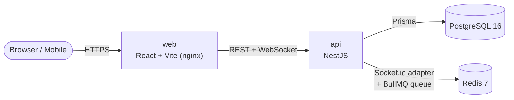

<div align="center">

# Next Lane

### The open-source, self-hosted issue & project tracker that's **free and unlimited** — where comparable cloud trackers charge per seat.

Plan work, run sprints, and drag cards across boards on **your** hardware, with **your** data, under an MIT license. One command to run. Zero seats to buy.

[](./LICENSE)
[](https://github.com/Overcastly-AI/Next-Lane/actions/workflows/ci.yml)
[](https://www.typescriptlang.org/)
[](https://nestjs.com/)
[](https://react.dev/)
[](#-quickstart)
[](#why-next-lane)
[](./CONTRIBUTING.md)

Built by [Overcastly AI](https://overcastly.com)

[Quick Start](#-quickstart) · [Why Next Lane](#why-next-lane) · [Features](#-whats-shipped) · [Architecture](#-architecture-at-a-glance) · [Roadmap](#-on-the-roadmap) · [Contributing](#-contributing) · [Docs](https://overcastly-ai.github.io/Next-Lane/) · [Changelog](./CHANGELOG.md)

</div>

---

## Table of Contents

- [Why Next Lane](#why-next-lane)
- [Screenshots](#-screenshots)
- [What's shipped](#-whats-shipped)
- [Quick Start](#-quickstart)
- [Local development](#-local-development-hot-reload-no-docker-for-app-code)
- [Architecture at a glance](#-architecture-at-a-glance)
- [On the roadmap](#-on-the-roadmap)
- [Contributing](#-contributing)
- [License](#-license)

---

## Screenshots

<div align="center">
  
</div>

<br/>

<div align="center">
  
  
  
</div>

<br/>

<div align="center">
  
  
</div>

<br/>

<div align="center">
  
  
</div>

## Why Next Lane

Most trackers are cloud SaaS billed **per user, per month** — your roadmap lives on
someone else's server and the price grows with your team. Next Lane flips that. It
runs entirely on your own machine via Docker, and because the marginal cost of a
seat on *your* hardware is zero, it's free and unlimited by design.

We don't try to out-checklist a 20-year-old incumbent. We win on four **structural
advantages** a cloud-first, per-seat, closed product can't match (full thesis in
[`docs/VISION.md`](./docs/VISION.md)):

|  | Advantage | What it means for you |
|---|---|---|
| 💸 | **Free & unlimited** | No per-seat pricing. Unlimited users, projects, automation runs, and (on the roadmap) AI — because it's your hardware. |
| 🔒 | **Your data, your compute** | Fully self-hosted. No egress, direct SQL access to your own data, private by default — the one thing regulated teams can't buy from any cloud. |
| 🧩 | **Open & extensible** | MIT licensed. No marketplace tax, code-level extensibility, and a path to self-hosted forges (Gitea/GitLab), not just the big clouds. |
| 🤖 | **AI-native & agent-native** | Built for the agent era — and dogfooded by a team of AI agents that build this very repo. |

## ✨ What's shipped

A credible daily-driver tracker today — not a toy. Everything below is **live in the
current build** (see [`docs/ROADMAP.md`](./docs/ROADMAP.md) for status and what's next).

| Area | Capabilities |
|------|-------------|
| **Boards** | Multiple boards per project · Kanban **and** Scrum board types · drag-and-drop with fractional ranking · custom statuses/columns · live presence indicators · conditional card colors |
| **Issues** | Task / Bug / Story / Epic / Sub-task · parent/child hierarchy · labels · story points · due dates · **custom fields** (typed) · markdown descriptions & comments · file attachments · **issue links** (BLOCKS, RELATES_TO, DUPLICATES…) · watchers |
| **Agile** | Backlog view · sprints (create / start / complete, goals, dates) · keyboard **triage mode** (j/k/s/p/a/l) |
| **NLQL** | **NLQL query language** — `assignee = me() AND priority in (High, Highest)` · **saved filters** shared across a project · boards pinned to a saved filter |
| **Reports** | Burndown · velocity · cumulative-flow diagram (CFD) · roadmap / timeline view · personal analytics · team pulse analytics |
| **Find** | **Full-text search** (Postgres `tsvector`) · ⌘K command palette · cross-project search · multi-field filtering |
| **Collaboration** | Comments & activity history · realtime updates (Socket.io) · in-app notifications & @mentions · "My Work" + Team Pulse dashboards |
| **Automation** | **Glass Box engine** — trigger → condition → action rules · NLQL-based conditions · unlimited runs · full **run log** (audit trail per execution) |
| **Rituals** | **Planning poker** (real-time estimation via Socket.io) · **async standups** (per-member responses + team digest) |
| **Personal** | **Personal boards** (private Kanban) · personal analytics · shared board links |
| **Bulk & export** | **Bulk edit** (multi-select in Backlog + Triage; update assignee/status/priority/labels/sprint) · **CSV export** |
| **Workspace** | **Branding** — custom name, accent color, logo · workspace audit log |
| **Admin & security** | Roles & permissions (Admin / Member / Viewer) · email/password auth (JWT) · personal API tokens (PATs) · password reset over SMTP · HMAC-signed outbound webhooks (with SSRF guard) |
| **Ops & deploy** | One-command Docker Compose · **Helm chart + Kustomize** for Kubernetes · GHCR multi-arch image builds · structured JSON logs · health/readiness probes · CI (typecheck + build + unit tests) + e2e suite |

## 🚀 Quickstart

> **Prerequisites:** [Docker](https://docs.docker.com/get-docker/) with Compose v2. That's it.

```bash
git clone https://github.com/Overcastly-AI/Next-Lane.git
cd Next-Lane
cp .env.example .env

# JWT_SECRET is REQUIRED — the API refuses to start without one:
echo "JWT_SECRET=$(openssl rand -hex 32)" >> .env

docker compose up -d --build
```

Then open:

| Service | URL |
|---------|-----|
| 🌐 **Web app** | http://localhost:3000 |
| ⚙️ **API** | http://localhost:4000 |
| 📚 **API docs (Swagger)** | http://localhost:4000/api |

A demo workspace, project, sprint, and issues are **seeded automatically**. Log in with:

- **Email:** `demo@nextlane.dev`
- **Password:** `nextlane`

Stop the stack with `docker compose down` (add `-v` to also wipe the database volume).

> Deploying to Kubernetes? See [`docs/DEPLOY-KUBERNETES.md`](./docs/DEPLOY-KUBERNETES.md)
> for the Helm chart, Kustomize overlays, and an HA topology guide.

## 🛠️ Local development (hot reload, no Docker for app code)

Next Lane is a pnpm monorepo. Run the datastores in Docker and the apps on your host:

```bash
pnpm install
docker compose up -d db redis      # just Postgres + Redis
pnpm db:migrate                    # apply Prisma migrations
pnpm db:seed                       # seed the demo workspace
pnpm dev                           # api + web with hot reload
```

Other useful scripts: `pnpm build`, `pnpm lint`, `pnpm test`, `pnpm format`.

## 🧱 Architecture at a glance

| Layer | Technology |
|-------|-----------|
| Backend | NestJS + Prisma (REST + Socket.io) |
| Database | PostgreSQL 16 |
| Realtime / queue | Redis 7 + Socket.io + BullMQ |
| Frontend | React + Vite + TypeScript |
| UI | Tailwind CSS + shadcn/ui · TanStack Query · dnd-kit |
| Auth | JWT access token · personal API tokens (PATs) |
| Infra | Docker Compose · Helm / Kustomize for Kubernetes |



Deeper dives: [`docs/ARCHITECTURE.md`](./docs/ARCHITECTURE.md) ·
[`docs/RESEARCH.md`](./docs/RESEARCH.md) ·
[`docs/DEPLOY-KUBERNETES.md`](./docs/DEPLOY-KUBERNETES.md).

```
Next-Lane/
├── apps/
│   ├── api/        # NestJS backend (REST + WebSocket)
│   └── web/        # React + Vite frontend
├── packages/
│   └── shared/     # Shared TypeScript types / contracts
├── deploy/         # Helm chart + Kustomize base & overlays
├── docs/           # Architecture, vision, roadmap, research
├── .claude/        # Claude Code skills, agents & workflows
└── docker-compose.yml
```

## 🔭 On the roadmap

Next Lane is built openly and incrementally. The shipped surface above is the
foundation; here's where the structural advantages get spent (full plan, with status
markers, in [`docs/ROADMAP.md`](./docs/ROADMAP.md) — driven by [`docs/VISION.md`](./docs/VISION.md)):

- **🤖 Autopilot** — a self-hosted AI teammate: private, unlimited, $0 AI (natural-language → NLQL, auto-triage, semantic dedupe, sprint risk radar) and **MCP-native** so coding agents read/write issues from the IDE.
- **Data ownership (Glass Box Phase 2)** — SQL / warehouse export, Grafana dashboards, and OpenTelemetry traces.
- **📚 The Unbundle** — free what others sell separately: docs/wiki, whiteboard, a public roadmap + voting portal, and intake forms.
- **🔗 Developer Graph** — two-way **GitHub / GitLab / Gitea** links, live PR/CI status on cards, auto-transition on merge.
- **Workflow transitions** — enforced status progressions with guard conditions.

Full plan with phase status markers: [`docs/ROADMAP.md`](./docs/ROADMAP.md) · vision and thesis: [`docs/VISION.md`](./docs/VISION.md).

## 🤝 Contributing

Contributions are welcome and appreciated! Start with [`CONTRIBUTING.md`](./CONTRIBUTING.md)
for setup, conventions, and the PR workflow. Good first steps:

- Found a bug? [Open a bug report](https://github.com/Overcastly-AI/Next-Lane/issues/new?template=bug_report.yml).
- Have an idea? [Request a feature](https://github.com/Overcastly-AI/Next-Lane/issues/new?template=feature_request.yml).
- Have a question? Start a [Discussion](https://github.com/Overcastly-AI/Next-Lane/discussions).
- Found a vulnerability? Please follow our [Security Policy](./SECURITY.md) — don't open a public issue.

The [documentation site](https://overcastly-ai.github.io/Next-Lane/) has detailed guides for configuration, self-hosting, features, and troubleshooting.

This project follows the [Contributor Covenant Code of Conduct](./CODE_OF_CONDUCT.md).

## 📄 License

[MIT](./LICENSE) — free for anyone to use, fork, and self-host.

> **Note on licensing:** self-hosted tools in this category are often released under
> **AGPL-3.0** to keep network-deployed modifications open. Next Lane currently ships
> under MIT for maximum adoption; this may be revisited early in the project's life.
> See [`docs/RESEARCH.md`](./docs/RESEARCH.md#6-licensing).

## Built by Overcastly AI

Next Lane is designed and maintained by [Overcastly AI](https://overcastly.com).

## Trademarks & disclaimer

Next Lane is an **independent, open-source project** — a general-purpose issue
tracker and agile project-management tool. It is **not affiliated with, endorsed by,
or sponsored by** any commercial issue-tracking vendor, and it is not a drop-in
replacement for, or branded competitor of, any specific commercial product. All
product names, logos, and brands mentioned anywhere in this repository are the
property of their respective owners and are used for identification purposes only.
