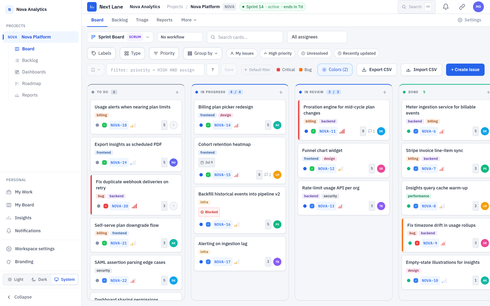
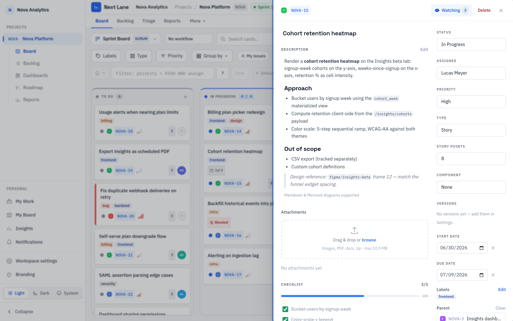

> Built by [Overcastly AI](https://overcastly.com) — open-source, MIT licensed, yours to self-host.

## One command to run it

```bash
git clone https://github.com/Overcastly-AI/Next-Lane.git
cd Next-Lane
cp .env.example .env
echo "JWT_SECRET=$(openssl rand -hex 32)" >> .env
docker compose up -d --build
```

Open **http://localhost:3000** — a demo workspace with sample issues is ready to explore.

Log in: `demo@nextlane.dev` / `nextlane`

---

## What's included

| Feature | Status |
|---------|--------|
| Kanban & Scrum boards with drag-and-drop | Live |
| NLQL structured query language | Live |
| Automation engine with Glass Box run log | Live |
| Real-time collaboration (Socket.io) | Live |
| Planning poker | Live |
| Async standups | Live |
| Reports: burndown, velocity, CFD, timeline | Live |
| Full-text search + command palette | Live |
| Webhooks (HMAC-signed, BullMQ-queued) | Live |
| Personal boards | Live |
| Bulk edit, CSV export | Live |
| Workspace branding (color, logo) | Live |
| MCP agent integration | Roadmap |
| Private AI inference | Roadmap |

See the full [Features](./guide/features) guide for details.

---

## Screenshots



*Kanban board — drag cards between columns, see live presence avatars, apply conditional card colors.*



*Issue detail drawer — Markdown description, comments, activity log, custom fields, all in-panel.*


*Backlog — bulk-select issues, filter with NLQL, plan sprints.*
